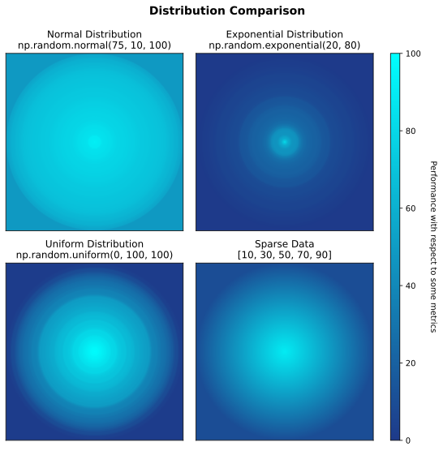
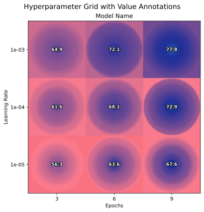

# ColorGradient

**Publication-ready visualization for 1D data distributions using intuitive circular color gradients**

[](https://badge.fury.io/py/colorgradient)
[](https://www.python.org/downloads/)
[](https://creativecommons.org/licenses/by-nc/4.0/)

## Why ColorGradient?

In the context of plotting hyperparameter search grids, traditional visualizations show only average values, ignoring critical information about underlying distribution. **ColorGradient reveals the full story** by displaying data distributions as intuitive circular gradients where the center represents the maximum value of the distribution and edges show the the minimal value of the distribution.

Perfect for machine learning researchers who need to:

- Compare models performance across hyperparameter grids (epochs × learning rates)
- Visualize multiple 1D data distribution, organized into a single figure of multiple rows and columns

## Features

- [x] Circular gradient visualization with center=max, edges=min
- [x] Nested grid layouts (each subfigure can contain multiple rows and columns): useful for hyperparameter grid search plots
- [x] Smart highlighting (using borders) for global/local best mean, median, min, max, p25, p75
- [x] Publication-ready, reproducible SVG output with optional legends

## Quick Start

### Installation
```
pip install colorgradient
```

## Examples

### Example 1: Basic Distribution Comparison



<details>
<summary>Show imports and color schema</summary>

```
import numpy as np
from colorgradient import plot_gradient_grid
import matplotlib.pyplot as plt
import matplotlib.colors as mcolors
import matplotlib as mpl
mpl.rcParams["svg.hashsalt"] = "42"

BLUE_CYAN_SCHEMA = {
	0: '#1E3A8A',		# Dark blue (poor performance)
	100: '#00FFFF'		# Cyan (excellent performance)
}

np.random.seed(42)
```
</details>

```
cell_data = [
	{'data': np.random.normal(75, 10, 100), 'title': 'Normal Distribution\nnp.random.normal(75, 10, 100)'},
	{'data': np.random.exponential(20, 80), 'title': 'Exponential Distribution\nnp.random.exponential(20, 80)'},
	{'data': np.random.uniform(0, 100, 100), 'title': 'Uniform Distribution\nnp.random.uniform(0, 100, 100)'},
	{'data': [10, 30, 50, 70, 90], 'title': 'Sparse Data\n[10, 30, 50, 70, 90]'}
]

fig, axes = plot_gradient_grid(
			cell_data=cell_data,
			color_schema=BLUE_CYAN_SCHEMA,
			rows=2,
			cols=2,
			figsize_per_cell=4,
			suptitle={
				'title': 'Distribution Comparison',
				'fontsize': 14,
				'bold': True
			}
		)
```

<details>
<summary>Show colorbar setup</summary>

```
# Move all subplots left to make room for colorbar
plt.subplots_adjust(right=0.82)

# Calculate proper colorbar position to match subplot heights
subplot_positions = axes[0, 0].get_position()
subplot_bottom = subplot_positions.y0
subplot_top = axes[0, 0].get_position().y1
subplot_height = subplot_top - subplot_bottom
row_spacing = axes[0, 0].get_position().y0 - axes[1, 0].get_position().y1
total_height = 2 * subplot_height + row_spacing
colorbar_bottom = axes[1, 0].get_position().y0		# Bottom-left subplot
colorbar_axis = fig.add_axes([0.85, colorbar_bottom, 0.02, total_height])

colormap = mcolors.LinearSegmentedColormap.from_list('darkblue_to_cyan', ['#1E3A8A', '#00FFFF'])
norm = mcolors.Normalize(vmin=0, vmax=100)
colorbar = plt.colorbar(plt.cm.ScalarMappable(norm=norm, cmap=colormap), cax=colorbar_axis)
colorbar.set_label('Performance Score', rotation=270, labelpad=20)

plt.savefig('example1_basic_distributions.svg', dpi=300, bbox_inches='tight', metadata={'Date': None})
```
</details>

### Example 2: Single Model Hyperparameter Grid



<details>
<summary>Show imports and benchmark data generation</summary>

```
import numpy as np
from colorgradient import plot_gradient_grid, DEFAULT_COLOR_SCHEMA
import matplotlib.pyplot as plt
import matplotlib as mpl
mpl.rcParams["svg.hashsalt"] = "42"

np.random.seed(42)
epochs = [3, 6, 9]
learning_rates = [1e-3, 1e-4, 1e-5]

grid_data = {}
for lr_idx, lr in enumerate(learning_rates):
	for epoch_idx, epoch in enumerate(epochs):
		base_perf = 60 + epoch * 2 - lr_idx * 5
		performance = np.random.normal(base_perf, 5 + lr_idx * 2, 50)
		grid_data[(lr_idx, epoch_idx)] = np.clip(performance, 0, 100)
```
</details>

```
cell_data = [{
	'grid_data': grid_data,
	'title': 'Model Name',
	'row_labels': [f'{lr:.0e}' for lr in learning_rates],
	'col_labels': [str(e) for e in epochs],
	'xlabel': 'Epochs',
	'ylabel': 'Learning Rate'
}]

fig, axes = plot_gradient_grid(
	cell_data,
	DEFAULT_COLOR_SCHEMA,
	rows=1,
	cols=1,
	figsize_per_cell=6,
	show_values=True
)
fig.suptitle('Hyperparameter Grid with Value Annotations', fontsize=14)
plt.savefig('example2_hyperparameter_grid.svg', dpi=300, bbox_inches='tight', metadata={'Date': None})
```

### Example 3: Multi-Model Comparison (Clean)


<details>
<summary>Show helper function</summary>

```
def generate_model_data(model_idx, epochs, learning_rates, seed=42):
	"""Generate synthetic hyperparameter search data for a model"""
	np.random.seed(seed + model_idx)
	grid_data = {}
	for lr_idx, lr in enumerate(learning_rates):
		for epoch_idx, epoch in enumerate(epochs):
			base_performance = 60 + model_idx * 5
			epoch_effect = epoch * 2
			lr_effect = (2 - lr_idx) * 3
			noise_scale = 8 + lr_idx * 2
			n_samples = 50
			performance_data = np.random.normal(base_performance + epoch_effect + lr_effect, noise_scale, n_samples)
			performance_data = np.clip(performance_data, 0, 100)
			grid_data[(lr_idx, epoch_idx)] = performance_data
	return grid_data

# For Model-1 (model_idx=0) with epochs=[3, 6, 9] and learning_rates=[1e-3, 1e-4, 1e-5]
grid_data = {
	(0, 0): array([75.97, 70.89, 77.18, ...]),		# lr=1e-03, epoch=3, 50 samples, mean=70.20
	(0, 1): array([81.45, 75.32, 79.88, ...]),		# lr=1e-03, epoch=6, 50 samples, mean=78.14
	(0, 2): array([87.92, 80.56, 84.71, ...]),		# lr=1e-03, epoch=9, 50 samples, mean=83.58
	(1, 0): array([68.54, 72.31, 65.89, ...]),		# lr=1e-04, epoch=3, 50 samples, mean=69.84
	(1, 1): array([74.21, 78.65, 71.92, ...]),		# lr=1e-04, epoch=6, 50 samples, mean=76.24
	(1, 2): array([79.38, 82.47, 76.83, ...]),		# lr=1e-04, epoch=9, 50 samples, mean=80.70
	(2, 0): array([65.12, 69.78, 62.45, ...]),		# lr=1e-05, epoch=3, 50 samples, mean=66.39
	(2, 1): array([71.89, 76.32, 69.54, ...]),		# lr=1e-05, epoch=6, 50 samples, mean=74.18
	(2, 2): array([75.67, 79.21, 73.89, ...])		# lr=1e-05, epoch=9, 50 samples, mean=77.36
}

import os
import numpy as np
from colorgradient import plot_gradient_grid, DEFAULT_COLOR_SCHEMA
import matplotlib.pyplot as plt
import matplotlib as mpl
mpl.rcParams["svg.hashsalt"] = "42"
```
</details>

```
models = ['Model-1', 'Model-2', 'Model-3', 'Model-4', 'Model-5']
epochs = [3, 6, 9]
learning_rates = [1e-3, 1e-4, 1e-5]

cell_data = []
for model_idx, model_name in enumerate(models):
	grid_data = generate_model_data(model_idx, epochs, learning_rates)
	cell_data.append({
		'grid_data': grid_data,
		'title': model_name,
		'row_labels': [f'{lr:.0e}' for lr in learning_rates],
		'col_labels': [str(epoch) for epoch in epochs],
		'xlabel': 'Epochs',
		'ylabel': 'Learning Rate'
	})

# Add color schema legend (excluded from best highlighting)
color_schema_grid = {}
schema_values = [[75.0, 90.0, 100.0], [70.0, 85.0, 97.5], [65.0, 80.0, 95.0]]
for i in range(3):
	for j in range(3):
		color_schema_grid[(i, j)] = [schema_values[i][j]]

cell_data.append({
	'grid_data': color_schema_grid,
	'title': 'Color Schema',
	'row_labels': [],
	'col_labels': [],
	'exclude_from_best': True
})

fig, axes = plot_gradient_grid(
	cell_data,
	DEFAULT_COLOR_SCHEMA,
	rows=2,
	cols=3,
	figsize_per_cell=4,
	show_values=False
)
fig.suptitle('Model Comparison: Hyperparameter Search Results', fontsize=14)
plt.savefig('example_hyperparameter_grid_1.svg', dpi=300, bbox_inches='tight', metadata={'Date': None})
```

### Example 4: With Value Annotations


```
# Same code as Example 3, but add show_values=True:
fig, axes = plot_gradient_grid(
	cell_data,
	DEFAULT_COLOR_SCHEMA,
	rows=2,
	cols=3,
	figsize_per_cell=4,
	show_values=True		# <-- Show mean values
)
fig.suptitle('Model Comparison with Mean Annotations', fontsize=14)
plt.savefig('example_hyperparameter_grid_2.svg', dpi=300, bbox_inches='tight')
```

### Example 5: With Border Highlighting


```
highlight_borders = {
	'local_best_mean': {'enabled': True, 'color': '#08CB00', 'override': 'Local best (Average)'},
	'local_best_max': {'enabled': True, 'color': '#0FFFFF'},
	'global_best_mean': {'enabled': True, 'color': '#F7A8C4', 'override': 'Global best (Average)'},
	'global_best_median': {'enabled': True, 'color': '#FFD65A'}
}

suptitle_config = {
	'title': 'Hyperparameter Grid Comparison\nAcross 5 Models and Various Configurations',
	'fontsize': 16,
	'bold': False,
	# 'y_override': 0.97		# Optional: adjust for multi-line titles
}

fig, axes = plot_gradient_grid(
	cell_data,
	DEFAULT_COLOR_SCHEMA,
	rows=2, cols=3,
	figsize_per_cell=4,
	highlight_borders=highlight_borders,
	show_values=True,
	suptitle=suptitle_config,
	copyright_text='© 2025 ColorGradient Contributors'
)
plt.savefig('example_hyperparameter_grid_3.svg', dpi=300, bbox_inches='tight', metadata={'Date': None})
```

## API Documentation

### `plot_gradient_grid(cell_data, **kwargs)`

**Core Parameters:**
- `cell_data` (list): List of subplot configurations
	- **Simple mode**: `{'data': [values], 'title': 'Name'}`
	- **Grid mode**: `{'grid_data': {(row,col): [values]}, 'title': 'Name', 'row_labels': [...], 'col_labels': [...]}`
	- **Exclusion**: `{'exclude_from_best': True}` to exclude from best cell highlighting

**Visualization Options:**
- `color_schema` (dict): Color mapping `{value: '#HEX'}`. Default: `DEFAULT_COLOR_SCHEMA`
- `rows`, `cols` (int): Grid dimensions
- `figsize_per_cell` (float): Size per cell in inches (default: 4.0)
- `resolution` (int): Gradient resolution (default: 500)
- `show_values` (bool): Display mean values as overlay text

**Border Highlighting:**
- `highlight_borders` (dict): Configure borders for best performance
	- Available types: `local_best_mean/median/min/max/p25/p75`, `global_best_mean/median/min/max/p25/p75`
	- Config: `{'enabled': True, 'color': '#HEX', 'override': 'Custom Label'}`

**Suptitle Configuration:**
- `suptitle` (dict): `{'title': str, 'fontsize': int, 'bold': bool, 'y_override': float}`
	- Automatically adjusts spacing for multi-line titles

**Returns:** `(fig, axes)`, which is matplotlib figure and axes for further customization

### Default Color Schema

```
DEFAULT_COLOR_SCHEMA = {
	0: '#F44336',		# Red (poor)
	50: '#FB7B8E',		# Pink
	80: '#1F2F98',		# Dark blue
	90: '#2973B2',		# Blue
	95: '#4E71FF',		# Light blue
	97.5: '#4ED7F1',	# Cyan
	100: '#38E54D'		# Green (excellent)
}
```

## Use Cases

**Machine Learning Research**
- Hyperparameter optimization visualization
- Any 1D data visualization, especially when comparing multiple 1D arrays measured in the same metrics

**Scientific Publishing** 
- Distributions across experiments
- Treatment effect comparisons with variance
- Statistical result summaries

## Running Examples

```
cd examples
python example.py
python example_hyperparameter_grid.py
```

## License

Creative Commons Attribution-NonCommercial 4.0 (CC BY-NC 4.0)

## Citation

```
@software{colorgradient2025,
	title = {ColorGradient: Publication-ready hyperparameter search visualization},
	author = {ColorGradient Contributors},
	year = {2025},
	url = {https://github.com/PhyloBridge/ColorGradient}
}
```